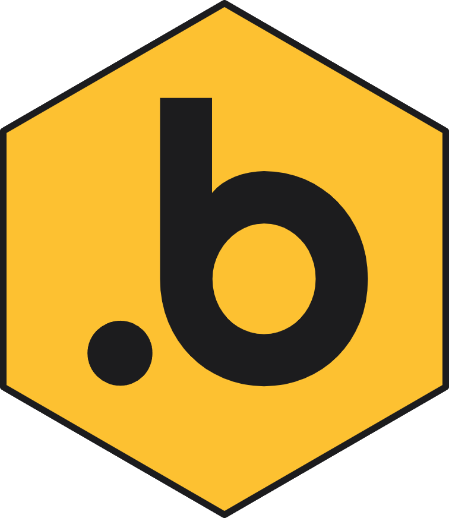

# dotBRIDGE - Sitecore APIs

**.NET SDKs for SitecoreAI, Experience Edge, CDP, and Sitecore Search — part of the [dotBRIDGE](https://ping-works.com.au/partners/dotBRIDGE) effort by [PING Works](https://ping-works.com.au).**

This repository is the documentation and release home for the strongly-typed .NET SDKs that
PING Works publishes to NuGet for working with SitecoreAI and the wider Sitecore SaaS platform.
Each library has its own README here, cross-referenced from the corresponding NuGet package.

> The packages are **free to use** and published on NuGet, but they are **not open-source
> licensed**. Some other dotBRIDGE libraries (still to be published) will be released under MIT —
> see [About dotBRIDGE](#about-dotbridge) below.

---

## About dotBRIDGE

**dotBRIDGE** is PING Works' product name for the range of .NET supporting libraries, SDKs, and
Azure blueprints that let teams build on — and migrate onto — **SitecoreAI** without a ground-up
rebuild.

The premise is simple: a Sitecore XM or XP estate built on .NET MVC or SXA represents a decade of
custom components and content. dotBRIDGE provides a second upgrade path onto SitecoreAI that keeps
the same language (.NET), the same runtime, and the same Sitecore data — porting the rendering head
to Blazor on Azure rather than rebuilding it from scratch on a different stack.

dotBRIDGE spans three layers:

- **A Blazor rendering head** that replaces Sitecore's Content SDK at runtime.
- **A Blok-based Blazor UI library** ([`SitecoreBlok.BlazorUI`](https://github.com/PINGWorks-AU/SitecoreBlok.BlazorUI), OSS / Apache-2.0)
  — a Blazor port of Sitecore's Blok design system for building first-party-looking Marketplace plugins.
- **Strongly-typed API SDKs** — the libraries documented in this repository, which wrap Sitecore's
  public APIs behind typed, dependency-injection-friendly interfaces.

**This repository contains the SDK layer — a subset of the full dotBRIDGE code.** Other libraries
(including the Marketplace SDK and the commercial SitecoreAI Blazor head) are published separately.

---

## The libraries

All SDKs share a consistent design:

- Typed, DI-friendly service interfaces over Sitecore's public APIs
- Async-first APIs (with `CancellationToken` or job/environment parameters where relevant)
- `netstandard2.1` for wide runtime compatibility
- `System.Text.Json` serialization
- Automatic token maintenance (client-credentials flow) for the APIs that require OAuth
- Shared cross-cutting HttpClient defaults (standard resilience handler + DEBUG-only request logging)

### SitecoreAI authoring APIs

| Library | NuGet | What it does |
| - | - | - |
| [PINGWorks.SitecoreAI.PagesSDK](PINGWorks.SitecoreAI.PagesSDK/README.md) | [nuget](https://www.nuget.org/packages/PINGWorks.SitecoreAI.PagesSDK) | Pages authoring — create, retrieve, update, version, lay out, translate, and search pages via the SitecoreAI Pages API. |
| [PINGWorks.SitecoreAI.SitesSDK](PINGWorks.SitecoreAI.SitesSDK/README.md) | [nuget](https://www.nuget.org/packages/PINGWorks.SitecoreAI.SitesSDK) | Site and host configuration — sites, collections, hosts, languages, sitemaps, hierarchy, and editor profiles, with focused per-group interfaces. |

### Experience Edge

| Library | NuGet | What it does |
| - | - | - |
| [PINGWorks.SitecoreExperienceEdge.ContentSDK](PINGWorks.SitecoreExperienceEdge.ContentSDK/README.md) | [nuget](https://www.nuget.org/packages/PINGWorks.SitecoreExperienceEdge.ContentSDK) | Content delivery over the Edge Delivery (GraphQL) API, with strongly-typed Sitecore field models and optional Polyglot-generated query types. |
| [PINGWorks.SitecoreExperienceEdge.AdminSDK](PINGWorks.SitecoreExperienceEdge.AdminSDK/README.md) | [nuget](https://www.nuget.org/packages/PINGWorks.SitecoreExperienceEdge.AdminSDK) | Tenant and schema administration — cache, settings, content, and webhook management via the Edge Admin API. |
| [PINGWorks.SitecoreExperienceEdge.PublishingSDK](PINGWorks.SitecoreExperienceEdge.PublishingSDK/README.md) | [nuget](https://www.nuget.org/packages/PINGWorks.SitecoreExperienceEdge.PublishingSDK) | Publishing orchestration — create, list, filter, and cancel publishing jobs, with offset and checkpoint pagination. |
| [PINGWorks.SitecoreExperienceEdge.EventsSDK](PINGWorks.SitecoreExperienceEdge.EventsSDK/README.md) | [nuget](https://www.nuget.org/packages/PINGWorks.SitecoreExperienceEdge.EventsSDK) | Event analytics — record page-view, identity, form, and custom events through the Edge Events API. |
| [PINGWorks.SitecoreExperienceEdge.AgentSDK](PINGWorks.SitecoreExperienceEdge.AgentSDK/README.md) | [nuget](https://www.nuget.org/packages/PINGWorks.SitecoreExperienceEdge.AgentSDK) | Agent integration — sites, pages, content, components, assets, personalization, brand kits, and briefs, with job-scoped operations that can be traced and reverted. |
| [PINGWorks.SitecoreExperienceEdge.Common](PINGWorks.SitecoreExperienceEdge.Common/README.md) | [nuget](https://www.nuget.org/packages/PINGWorks.SitecoreExperienceEdge.Common) | Shared support library. Not installed directly — a transitive dependency of the Experience Edge SDKs that wires up the cross-cutting HttpClient resilience and logging defaults. |

### Sitecore Search

| Library | NuGet | What it does |
| - | - | - |
| [PINGWorks.SitecoreSearch.ExperienceSearch](PINGWorks.SitecoreSearch.ExperienceSearch/README.md) | [nuget](https://www.nuget.org/packages/PINGWorks.SitecoreSearch.ExperienceSearch) | Typed client for Sitecore ExperienceSearch (the search bundled with SitecoreAI). |
| [PINGWorks.SitecoreSearch.DiscoverSearch](PINGWorks.SitecoreSearch.DiscoverSearch/README.md) | [nuget](https://www.nuget.org/packages/PINGWorks.SitecoreSearch.DiscoverSearch) | Three typed clients for Sitecore Discover (formerly Reflektion) — Search, Events, and Ingestion — with JS-SDK-compatible visitor identity and consent gating. |
| [PINGWorks.SitecoreSearch.Common](PINGWorks.SitecoreSearch.Common/README.md) | [nuget](https://www.nuget.org/packages/PINGWorks.SitecoreSearch.Common) | Shared abstractions plus a Roslyn **source generator** that reads `sitecore-search.json` and emits strongly-typed document records. A transitive dependency of both Search SDKs. |

### Customer Data Platform

| Library | NuGet | What it does |
| - | - | - |
| [PINGWorks.SitecoreCDP.GuestSDK](PINGWorks.SitecoreCDP.GuestSDK/README.md) | [nuget](https://www.nuget.org/packages/PINGWorks.SitecoreCDP.GuestSDK) | Guest-side Sitecore CDP — manage guest records and their free-form data extensions via the CDP Guest API v2.1. |

---

## Getting started

Install the SDK(s) you need from NuGet, e.g.:

```shell
dotnet add package PINGWorks.SitecoreAI.PagesSDK
```

Each SDK registers through a single `AddSitecore…Sdk(…)` extension in `Program.cs` and binds its
options from configuration. The per-library READMEs above cover prerequisites (credentials,
context IDs), the available `AppSettings`, DI registration, and the full method surface.

> **Note on shared HttpClient defaults.** Every `AddSitecore…Sdk(…)` call routes through
> `AddSitecoreEECommon()`, which applies a standard resilience handler (retry, timeout, circuit
> breaker) to **every** HttpClient in your container, plus a DEBUG-only request/response logger.
> See the [PINGWorks.SitecoreExperienceEdge.Common](PINGWorks.SitecoreExperienceEdge.Common/README.md)
> README for how to customize this per client.

---

## Licensing

The packages in this repository are **free to use** but are **not open-source licensed** — see the
[Proprietary Distribution License](LICENSE.md) for the full terms (royalty-free redistribution and
commercial use, in unmodified form). This repository hosts their README documentation and library
releases for cross-referencing from the published NuGet packages.

Other dotBRIDGE libraries are published separately; some of those (such as the
[`SitecoreBlok.BlazorUI`](https://github.com/PINGWorks-AU/SitecoreBlok.BlazorUI) UI kit) are Apache-2.0 licensed.

---

## About PING Works

PING Works is a Sitecore Partner and technology enablement partner, part of District Group. The
dotBRIDGE effort is led by Richard Hauer, PING's CTO, a 15-time Sitecore MVP. Get in touch at
[sales@ping-works.com.au](mailto:sales@ping-works.com.au).

---

*Sitecore and SitecoreAI are trademarks of Sitecore Corporation A/S. PING Works is a Sitecore
Partner; dotBRIDGE is an independent product and is not endorsed by Sitecore. "MVP" refers to the
Sitecore Most Valuable Professional award programme.*
